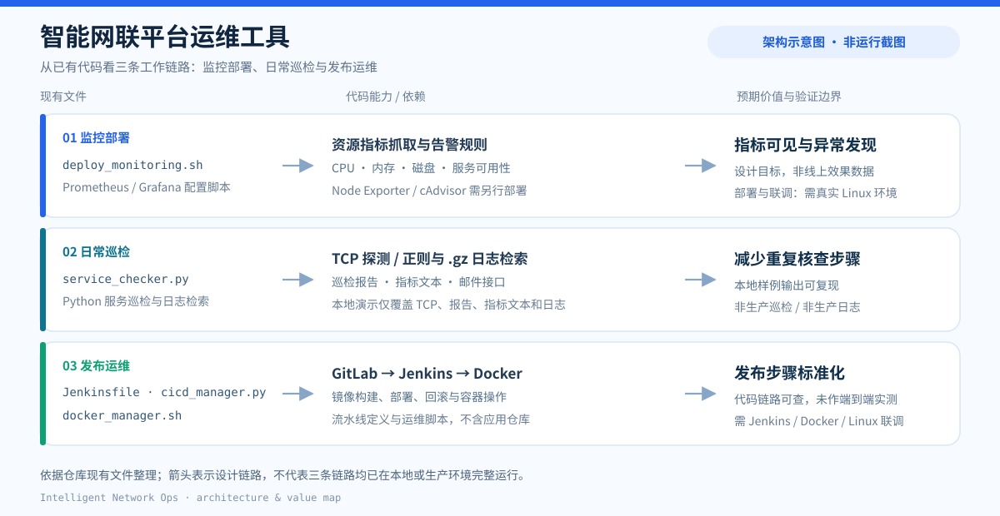
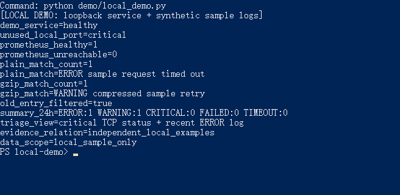
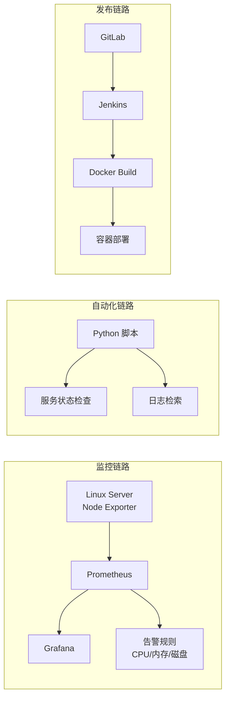

# 智能网联平台运维工具（Intelligent Network Ops）



> **图示性质：架构与价值示意图，不是运行截图。** 图中的三条链路依据仓库现有脚本与配置整理；右侧价值为设计目标，不代表已经测得的生产环境效果。

面向 Linux 服务器日常运维场景的轻量工具集：**资源监控告警、服务状态巡检、日志检索、CI/CD 发布与容器管理**。

项目核心开发时间 **2022.07 – 2022.10**，本仓库于 2026 年重新整理文档并开源，用于个人项目归档与求职展示。2026 年补充的架构图、本地演示与测试用于解释和核对代码能力，并修复了日志错误汇总入口的参数传递问题；不代表 2022 年已完成这些展示与修复工作。

**先看可复现证据：**运行 `python demo/local_demo.py`，仅在 `127.0.0.1` 上开启临时 TCP 监听，并用仓库内的样例日志模板演示巡检、报告、Prometheus 格式指标文本、日志检索及错误类型汇总。输出将异常服务状态与近期错误日志并排呈现，作为定位问题时的两类线索；两者是独立生成的样例，**不表示存在真实因果关系**。演示不会连接真实业务服务、发送邮件、部署监控系统或使用生产日志。输出示例与验证状态见[第 7 节](#7-验证状态与已知边界)。



> **运行截图，不是生产截图。** 2026 年 9 月在 Windows 上实际执行 `python demo/local_demo.py` 后抓取终端窗口；画面中的 `Command:` 行仅标识所执行命令，其余结果来自脚本。服务状态来自本机临时端口，日志来自仓库样例；未连接真实业务服务或使用生产数据。

---

## 1. 项目简介

解决 Linux 服务器运维中的几类重复性、易出错问题：

| 运维痛点 | 对应解决方案 |
|---------|-------------|
| 服务器资源状态不可见 | Prometheus + Grafana 部署与指标接入 |
| 异常发现不及时 | CPU / 内存 / 磁盘告警规则 |
| 重复的状态核查 | Python 服务状态检查脚本 |
| 日志查找耗时 | Python 日志检索脚本 |
| 构建部署靠手工 | GitLab + Jenkins + Docker 发布流水线 |

---

## 2. 项目架构



- **监控链路**：`Node Exporter → Prometheus → Grafana → 告警规则`
- **自动化链路**：`Python → 服务检查 / 日志检索`
- **发布链路**：`GitLab → Jenkins → Docker Build → 容器部署`

更详细的架构说明见 [docs/architecture.md](docs/architecture.md)。

---

## 3. 核心功能

### 3.1 Prometheus + Grafana 监控部署

**文件**：[monitoring_tool/deploy_monitoring.sh](monitoring_tool/deploy_monitoring.sh)

在 CentOS 7/8 上一键部署 Prometheus 2.40 与 Grafana 9.2，包含：

- 下载、解压并安装 Prometheus，创建 `prometheus` 系统用户与 systemd 服务
- 通过 YUM 源安装 Grafana 并启动
- 生成 `prometheus.yml`，配置 Node Exporter（节点资源）、cAdvisor（Docker）、应用服务等抓取目标
- 生成告警规则：CPU / 内存 / 磁盘 / 服务可用性
- 自动创建 Grafana 数据源与 Node Exporter 概览仪表盘

> 说明：抓取目标中的节点 IP 为占位符（`YOUR_NODE_IP_x`），Node Exporter / cAdvisor 的安装步骤未包含在本仓库内（脚本假设其已部署在目标节点上）。

### 3.2 CPU / 内存 / 磁盘告警规则

**文件**：[monitoring_tool/deploy_monitoring.sh](monitoring_tool/deploy_monitoring.sh)（内嵌告警规则）

| 指标 | 警告阈值 | 危急阈值 |
|------|---------|---------|
| CPU | > 80% | > 90% |
| 内存 | > 85% | > 95% |
| 磁盘 | > 85% | > 90% |

使用 PromQL 表达式（`node_cpu_seconds_total` / `node_memory_MemTotal_bytes` / `node_filesystem_size_bytes`）编写，另含服务离线（`up == 0`）告警。

### 3.3 Python 服务状态检查

**文件**：[monitoring_tool/service_checker.py](monitoring_tool/service_checker.py)

`ServiceChecker` 类：TCP 端口连通性探测、响应时间统计，支持批量检查多服务。已用隔离的本地监听端口与未监听端口验证（见第 7 节）。

### 3.4 Python 日志检索

**文件**：[monitoring_tool/service_checker.py](monitoring_tool/service_checker.py)

`LogSearcher` 类：按正则模式检索日志，支持 `.gz` 压缩日志、按时间范围过滤及按 ERROR / WARNING / CRITICAL / FAILED / TIMEOUT 汇总。本地演示验证了这些能力；汇总沿用直接检索的每文件每类型最多 100 条上限，不是无限量日志的全量统计，限制见第 7 节。

### 3.5 Jenkins 发布流水线

**文件**：[cicd_pipeline/Jenkinsfile](cicd_pipeline/Jenkinsfile)

声明式流水线：代码检出（GitLab）→ 依赖安装 → 代码检查 → 单元测试 → Docker 镜像构建与推送 → 集成测试 → 镜像扫描（Trivy）→ 测试/生产环境部署（蓝绿切换）→ 通知。

> 说明：`Jenkinsfile` 引用的 `Dockerfile` / `docker-compose.yml` 位于应用仓库，本仓库仅保留流水线定义与运维脚本。

### 3.6 Docker 构建与容器部署

**文件**：[cicd_pipeline/cicd_manager.py](cicd_pipeline/cicd_manager.py)、[container_manager/docker_manager.sh](container_manager/docker_manager.sh)

- `cicd_manager.py`：GitLab API 客户端 + Docker 客户端，实现镜像构建 / 推送 / 拉取 / 容器部署 / 回滚
- `docker_manager.sh`：容器状态 / 资源 / 日志查看、启停、健康检查、备份恢复、扩缩容、告警检查

---

## 4. 技术栈

| 类别 | 技术 |
|------|------|
| 操作系统 | CentOS 7/8、Linux |
| 监控 | Prometheus、Grafana、Node Exporter、cAdvisor |
| 告警 | Prometheus 告警规则、Python SMTP 邮件告警 |
| CI/CD | Jenkins、GitLab（API 对接） |
| 容器 | Docker、Docker Compose、私有镜像仓库 |
| 编程语言 | Python 3、Bash、Groovy（Jenkinsfile） |

---

## 5. 快速开始

### 隔离的本地演示（本次在 Windows 验证）

无需安装 `requirements.txt` 中的第三方依赖；只需要 Python 3 标准库。演示脚本运行现有 `ServiceChecker`、`LogSearcher`、`MonitorReporter`，并临时接管原脚本的 Linux 日志文件处理器，避免在本机写入 `/var/log/monitor`。

```bash
python demo/local_demo.py
python -m unittest discover -s tests -v
```

一次本地运行的稳定输出字段如下（**本地演示，非生产数据**；端口与时间由运行时生成，不作为效果指标）：

```text
[LOCAL DEMO: loopback service + synthetic sample logs]
demo_service=healthy
unused_local_port=critical
prometheus_healthy=1
prometheus_unreachable=0
plain_match_count=1
plain_match=ERROR sample request timed out
gzip_match_count=1
gzip_match=WARNING compressed sample retry
old_entry_filtered=true
summary_24h=ERROR:1 WARNING:1 CRITICAL:0 FAILED:0 TIMEOUT:0
triage_view=critical TCP status + recent ERROR log
evidence_relation=independent_local_examples
data_scope=local_sample_only
```

样例日志模板见 [`demo/sample_logs.txt`](demo/sample_logs.txt)。`{NOW}` / `{OLD}` 会在临时目录中替换为当前时间 / 48 小时前，便于重复验证 24 小时时间过滤；压缩日志也只在临时目录中生成。

> 以下步骤需在 **Linux（CentOS）** 环境执行，脚本使用了 `/var/log/monitor`、`/opt/monitoring` 等绝对路径。

### 5.1 部署监控平台

```bash
chmod +x monitoring_tool/deploy_monitoring.sh
sudo ./monitoring_tool/deploy_monitoring.sh
# 访问 Prometheus http://localhost:9090 / Grafana http://localhost:3000
```

### 5.2 运行服务巡检

```bash
python3 monitoring_tool/service_checker.py
# 通过 crontab 定时执行
0 9 * * * /usr/bin/python3 /opt/monitor/service_checker.py >> /var/log/monitor/cron.log 2>&1
```

### 5.3 管理容器

```bash
chmod +x container_manager/docker_manager.sh
./container_manager/docker_manager.sh status
./container_manager/docker_manager.sh health
```

### 5.4 CI/CD 发布（可选）

```bash
pip install -r requirements.txt
export GITLAB_URL=https://gitlab.example.com GITLAB_TOKEN=xxx DOCKER_REGISTRY=registry.example.com
python3 cicd_pipeline/cicd_manager.py deploy -p project/app -b main
```

---

## 6. 项目结构

```
intelligent-network-ops/
├── README.md
├── requirements.txt
├── .gitignore
├── assets/
│   ├── architecture-value.svg  # 基于现有代码的架构与价值示意图，非运行截图
│   └── local-demo-run.png       # 隔离本地演示的实际终端截图，非生产运行
├── demo/
│   ├── local_demo.py           # 2026 年新增的隔离本地演示
│   └── sample_logs.txt         # 含动态时间占位符的样例日志模板
├── tests/
│   ├── test_local_demo.py      # 本地演示的黑盒与指标解析测试
│   └── test_error_summary.py   # 错误汇总与时间窗口测试
├── monitoring_tool/             # 监控告警模块
│   ├── service_checker.py       # 服务状态检查 + 日志检索（Python）
│   └── deploy_monitoring.sh     # Prometheus + Grafana 部署脚本（Bash）
├── cicd_pipeline/               # CI/CD 发布模块
│   ├── cicd_manager.py          # GitLab/Docker 流水线管理（Python）
│   └── Jenkinsfile              # Jenkins 声明式流水线（Groovy）
├── container_manager/           # 容器管理模块
│   └── docker_manager.sh        # Docker 容器管理脚本（Bash）
└── docs/
    └── architecture.md          # 架构说明（Mermaid）
```

---

## 7. 验证状态与已知边界

| 环节 | 状态 | 本次依据 | 尚不能据此声称 |
|------|------|----------|----------------|
| TCP 服务巡检、报告与 Prometheus 格式指标文本 | **已验证：隔离本地演示** | `127.0.0.1` 临时监听与未监听端口；演示脚本调用原有类，生成健康/异常状态、报告和指标字符串；相关演示由 3 个黑盒测试覆盖 | `.prom` 文件写入、Node Exporter textfile collector 接入、生产告警效果 |
| 文本及 `.gz` 日志检索、24 小时时间过滤 | **已验证：隔离本地演示** | 样例日志模板在临时目录生成；两类日志各命中 1 条，48 小时前记录被过滤 | 真实业务日志检索效率或覆盖率 |
| Python 与 Bash 脚本语法 | **仅静态检查** | `py_compile` 检查 `service_checker.py`、`cicd_manager.py` 与演示脚本；`bash -n` 检查两个 Bash 脚本 | 脚本在目标 Linux 环境完成部署或业务联调 |
| Prometheus / Grafana 部署、指标文件与 collector 接入、邮件告警、Docker 容器操作及 Jenkins 发布 | **需要真实 Linux 与相关服务环境** | 仓库包含部署脚本和流水线定义，本次没有执行安装、指标文件写入/采集、发信、构建、推送或部署 | 端到端监控、CI/CD 与生产运行效果 |
| `LogSearcher.get_error_summary()` | **已验证：隔离本地演示** | 修复 `since_hours` 参数透传；对普通和 `.gz` 样例日志运行 24 小时汇总，另用测试验证 1 小时窗口均不计入 2 小时前记录；本次共 5 项自动化测试通过 | 无上限的全量计数、真实业务日志准确率或异常原因自动判定 |

其他边界：错误汇总按关键词匹配，同一行可能归入多个类型，每个文件每种类型最多返回 100 条；它是检索结果摘要，不是去重后的故障数。Node Exporter / cAdvisor 安装不在本仓库；`Jenkinsfile` 依赖应用仓库中的 `Dockerfile` / `docker-compose.yml`；`cicd_manager.py` 的「依赖安装 / 单元测试」阶段含占位实现。脚本生成的 Prometheus 配置未配置 Alertmanager 目标，Python 邮件接口也未在本次演示中发信。

---

## 8. 项目背景与个人工作

- **核心开发时间**：2022.07 – 2022.10
- **工作内容**：面向 Linux 服务器巡检与异常发现需求，编写监控部署、服务巡检、日志检索与发布流水线脚本
- **2026 年**：重新整理目录结构、补充 README 与架构文档、清理敏感信息后开源归档；增加明确标注的架构示意图、隔离本地演示与测试，并修复错误汇总的参数传递

> 本仓库未伪造 2022 年的提交记录；现有 Git 历史为整理归档时生成的提交。
