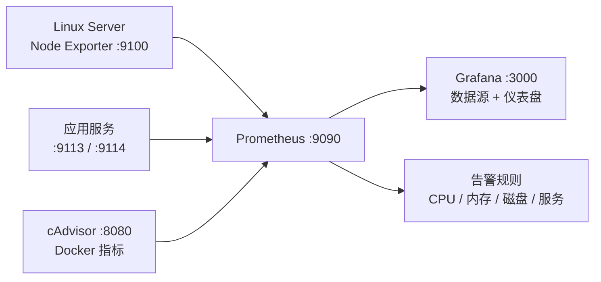
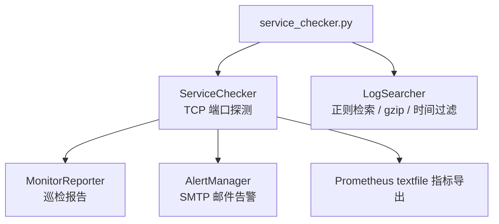

# 架构说明

本项目的三条核心链路：**监控**、**自动化巡检**、**发布**。每条链路均对应仓库内真实存在的脚本 / 配置文件。

## 1. 监控链路

**对应文件**：`monitoring_tool/deploy_monitoring.sh`

- 部署 Prometheus + Grafana，生成 `prometheus.yml`（抓取 Node Exporter / cAdvisor / 应用服务）
- 内嵌 CPU / 内存 / 磁盘 / 服务可用性告警规则
- 自动创建 Grafana Prometheus 数据源与 Node Exporter 概览仪表盘

## 2. 自动化巡检链路

**对应文件**：`monitoring_tool/service_checker.py`

## 3. 发布链路

**对应文件**：`cicd_pipeline/Jenkinsfile`、`cicd_pipeline/cicd_manager.py`、`container_manager/docker_manager.sh`

## 文件 ↔ 功能映射

| 文件 | 链路 | 功能 |
|------|------|------|
| `monitoring_tool/deploy_monitoring.sh` | 监控 | 部署 Prometheus + Grafana，配置抓取目标与告警规则 |
| `monitoring_tool/service_checker.py` | 巡检 | 服务状态检查、日志检索、邮件告警、指标导出 |
| `cicd_pipeline/Jenkinsfile` | 发布 | Jenkins 声明式流水线（构建/测试/部署） |
| `cicd_pipeline/cicd_manager.py` | 发布 | GitLab API + Docker 镜像构建推送部署回滚 |
| `container_manager/docker_manager.sh` | 运维 | 容器启停、日志、健康检查、备份恢复 |
